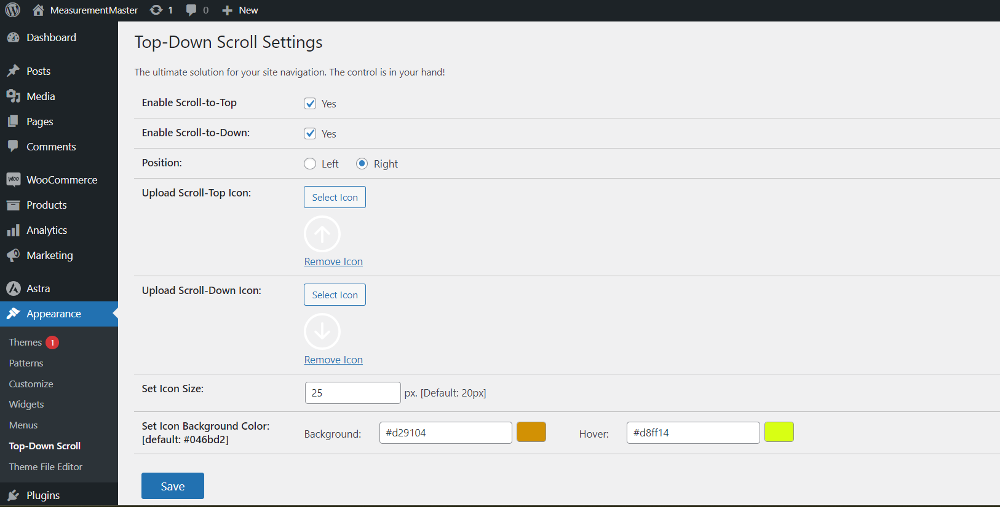

# Top-Down Scroll

This plugin adds a customizable scroll-to-top and scroll-to-bottom button on your WordPress website. With this plugin activated, users can easily navigate to the top or bottom of the page with just a click, enhancing user experience and navigation on your site.

Features:
- Easily customizable button styles
- Smooth scrolling animation for a polished user experience
- Options to enable/disable scroll-to-top and scroll-to-bottom buttons separately
- Supports various screen sizes and devices
- Set button position left/right
- Upload your custom icon
- Set background color and icon size

